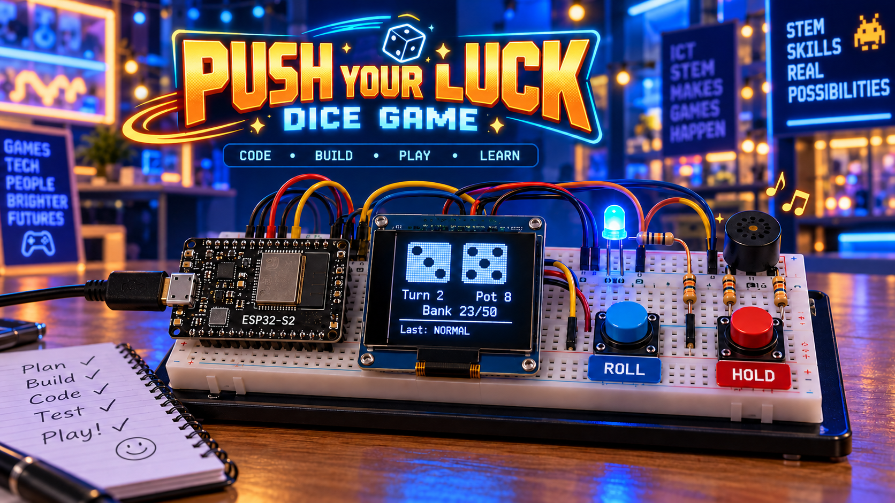
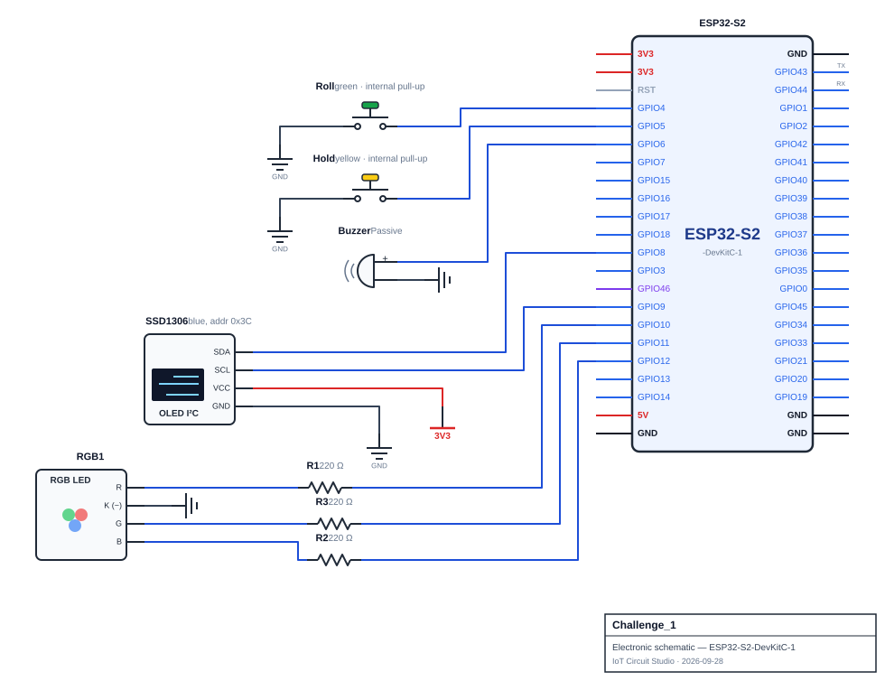

<div align="center">

# Challenge 1

# Push-Your-Luck Dice Game with Melodies

</div>

<p align="center">
  
</p>

## Scenario
A school runs a STEM open night, and your stall is a pocket dice arcade. Visitors play a solo game of push-your-luck dice. The goal is to bank 50 points in as few turns as possible.

Each roll shows two dice. Points from a roll go into a pot, and the pot is at risk until the player presses Hold. Hold banks the pot into the total score and ends the turn. Rolling a 1 wipes the pot. Rolling two 1s (snake eyes) is a disaster that wipes the banked score too. Rolling doubles is a bonus, because the total counts twice. Every visitor has to decide, roll after roll, whether to bank what they have or press their luck.

The game talks back in three ways. A small OLED screen draws both dice with real pips and shows the scores. An RGB LED glows a different colour for each kind of result. A passive buzzer plays a short melody for each result: a rattle while the dice tumble, then a jingle, a groan or a fanfare depending on what came up. The best five finished games are kept on a leaderboard, and the Serial monitor prints it along with roll statistics.

The whole game runs without a single `delay()` in `loop()`. The dice tumble, the melody and the buttons all have to work at the same time. A visitor who presses Hold while a jingle is still playing should get an instant response.

## Game Rules
The game is always in one of three states: READY (waiting for a button), TUMBLING (dice in motion) or GAME OVER. When a tumble ends, the final dice are scored:

| Dice | Event | Effect |
|---|---|---|
| 1 and 1 | SNAKE EYES | Pot and banked total both reset to 0. Turn ends |
| Exactly one 1 | BUST | Pot resets to 0. Turn ends |
| Two matching dice (not 1 and 1) | DOUBLES | Twice the total is added to the pot |
| Anything else | NORMAL | The total is added to the pot |

Hold adds the pot to the banked total, resets the pot and ends the turn. The turn number goes up whenever a turn ends. If the banked total reaches the target score (50), the game is won and becomes GAME OVER.

## Components Required
- ESP32-S2 development board
- 2× push button (`INPUT_PULLUP`): Roll button and Hold button
- RGB LED (common cathode) and 3× 220 Ω resistor, one per colour channel
- Passive buzzer for the melodies
- SSD1306 OLED display (128×64, I²C) for the dice and scores
- Jumper wires, breadboard

> **Schematic:**

<p align="center">
  
</p>

> **Check your RGB LED type before you code.** A common-cathode LED lights when a pin goes high and its shared leg goes to GND. A common-anode LED is the opposite, and a higher `analogWrite()` value makes it dimmer. Wokwi's RGB LED is common cathode by default. If the colours look inverted in your circuit, check the `common` setting on the part before changing any code.

## Functional Requirements

1. **Roll log.** `roll_log[MAX_ROLLS]` of `RollRecord` (`turn`, `die1`, `die2`, `total`, `event`, `timestamp`), appended by `log_roll()` for each completed roll. Drop the oldest record when full.

2. **Inputs.** One debounced (40 ms) `button_pressed(ButtonState &button)` serves both buttons. Roll starts a tumble (READY), starts a new game (GAME OVER), or is ignored (TUMBLING). Hold banks the pot when READY and pot > 0, otherwise it's ignored (`Nothing to bank`). Call `randomSeed(micros())` once, on the first Roll press.

3. **Lookup tables**, each returning a checked sentinel for an unrecognised key:
   - `roll_dice(int &first, int &second)`: random 1–6 via reference parameters.
   - `get_setting(String key)`: `target_score` = 50, `tumble_time` = 1500 ms, `tumble_step` = 100 ms.
   - `get_event_name(int event)`: the seven events below.

4. **Game rules and states.** Implement [Game Rules](#game-rules) in `resolve_roll()`. Add the result to the leaderboard once on a win. Print every roll and its event to Serial.

5. **Outputs.** Seven events, numbered TICK(0)–WIN(6), index every table below:
   - **Tumble:** every `tumble_step` ms, new random faces plus the TICK colour/sound; settle after `tumble_time` via `roll_dice()`.
   - **Melodies:** table-driven (`melodyNotes[][]`, `melodyLengths[][]`), non-blocking, no `if`/`else` chain. 0 Hz = rest, 0 length = end; a new melody replaces the old one.
   - **Colours:** table-driven (`eventColours[][3]`) via `analogWrite()`, no `if`/`else` chain.

   Use these values or your own, as long as every event is distinct and no melody exceeds 2 seconds.

   | Event | Colour (R, G, B) | Melody (Hz for ms) |
   |---|---|---|
   | TICK | dim white (40, 40, 40) | 1200 for 30 |
   | NORMAL | blue (0, 0, 255) | 659 for 100, 784 for 150 |
   | DOUBLES | gold (255, 160, 0) | 523, 659, 784 for 80 each, then 1047 for 250 |
   | BUST | red (255, 0, 0) | 392 for 200, 330 for 200, 262 for 400 |
   | SNAKE EYES | purple (160, 0, 255) | 330, 311, 294 for 300 each, then 262 for 600 |
   | BANK | green (0, 255, 0) | 1047 for 90, 1319 for 90, 1568 for 220 |
   | WIN | cyan (0, 255, 255) | 523 for 120 three times, 784 for 300, rest for 100, 659 for 120, 784 for 120, 1047 for 500 |

6. **Leaderboard.** Best `MAX_RESULTS` (5) games in `scoreboard[]` of `GameResult` (`turns`, `rolls`, `timestamp`), kept sorted by insertion in `add_result()`, never re-sorted from scratch. Fewer turns wins; ties go to fewer rolls, then to the earlier game. Ranking logic lives in one comparison function. Returns the new rank, or `-1` if the game didn't make the board.

7. **Statistics.** `compute_stats()` gives the average and highest dice total (with the roll index), a `totalCount[]` histogram (2–12), the most common total, and the bust count (BUST + SNAKE EYES). Recompute after every log; guard against divide-by-zero.

8. **Serial report** every 2000 ms: state, turn, pot, banked total, statistics, leaderboard, newest 5 rolls.

9. **OLED** (SSD1306, `Wire.begin(8, 9)`, address `0x3C`). Show state, turn, both dice via a 2-D `pipPattern[7][9]` table, pot, bank vs. target (`Bank 23/50`), and the newest event (`Last: none` initially, inverse video in GAME OVER). Redraw on change or every 2000 ms. Game keeps running if the OLED is missing.

10. **No `delay()` in `loop()`.**

## Submission Requirements
- A working Wokwi link with your circuit built and your code loaded and running.
- Your main source file (`.ino` if using the Arduino IDE, or `src/main.cpp` + `platformio.ini` if using PlatformIO).
- Brief written answers to the Reflection Questions below (a few sentences each is enough).

> Once your build works in Wokwi, build the circuit on real hardware and run the same code on it.

>[!NOTE]
> Wokwi link: https://wokwi.com/projects/476092334344782849

## Reflection Questions
Answer these in your own words. They're the kind of question the real Assessment 1 may ask you to justify verbally or in writing:

1. A function needs to hand back two results at once. Why can't a normal `return` do this job on its own, and what would the calling code see if you passed those parameters by value instead of by reference?
   ```


   ```

2. You seed a random number generator once, using a changing value such as `micros()` at the first user input. What would someone notice if you seeded with a fixed number instead? Why is a value read at runtime a better seed than one fixed in `setup()`?
   ```


   ```

3. A classmate builds a sequence of timed outputs using a loop with `delay()` between steps. Describe two things that would visibly go wrong during use, and explain how a non-blocking, `millis()`-based approach avoids them.
   ```


   ```

4. Suppose you need to add a new case to your code. List every place you would need to change it, and explain why a table-driven design makes that list shorter than an `if`/`else` chain would.
   ```


   ```

5. Inserting a new item into a list that is already sorted, rather than appending it and re-sorting the whole array, is cheaper. Why? What would happen to two items that rank equally if your comparison used `<=` instead of `<`?
   ```


   ```

6. Some inputs are ignored while the system is mid-action. Describe a sequence of inputs where allowing them anyway would give an unfair advantage or corrupt stored data.
   ```


   ```

7. An array is declared with more slots than the number of distinct values it needs to hold. What do the unused slots hold, and what would go wrong if the array were declared exactly as large as the number of possible values but still indexed directly by value?
   ```


   ```
