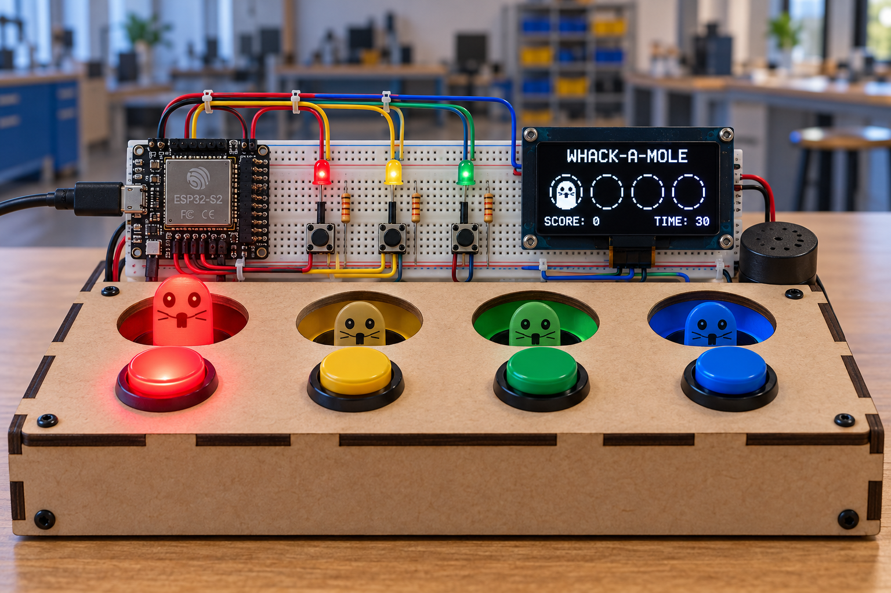
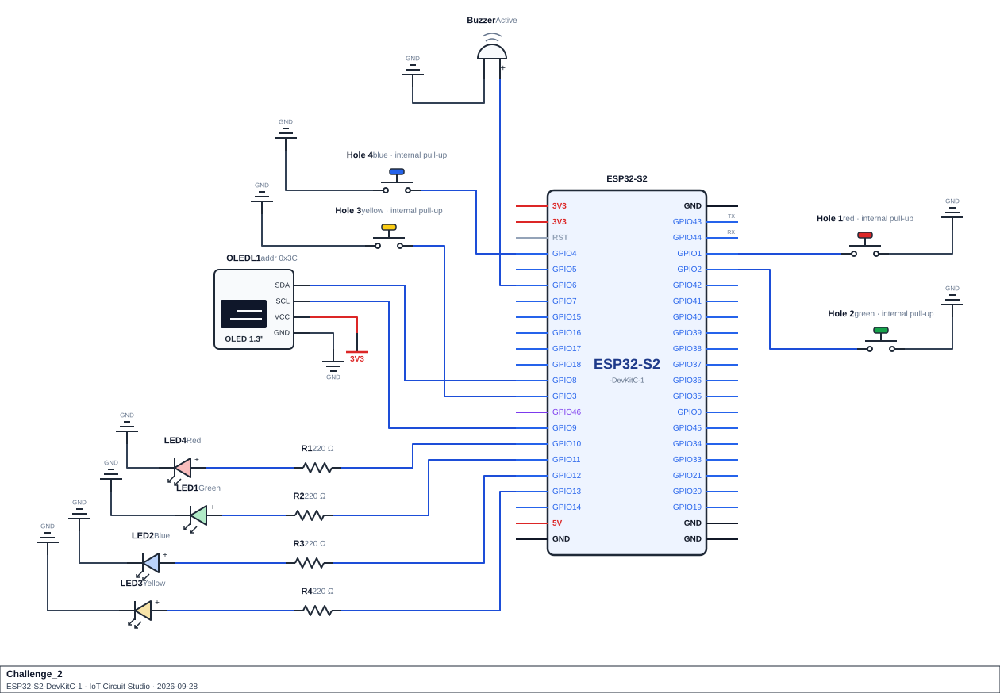

<div align="center">

# Challenge 2

# Whack-a-Mole Reaction Game

</div>

<p align="center">
  
</p>

## Scenario
A science centre has a "Whack-a-Mole" reaction game in its foyer. There are four holes, each with an LED and a button beneath it (red, yellow, green and blue). A mole pops up in one hole at a time: its LED lights and the buzzer beeps. The player has to press the matching button before the mole hides again.

Nothing about the game is predictable. Which hole the next mole uses is random (and never the same hole twice in a row). The pause before it appears is random, so the player can't time their press in advance. One mole in five is golden: it beeps an octave higher, hides sooner and is worth double.

Faster reactions score more. The longer a player survives, the harder the game gets: every hit shortens the time a mole stays up, until it reaches a minimum. Pressing the wrong button costs points, and a mole that hides before it is hit escapes for no points. A round is 15 moles, and the OLED shows the four holes, the score and the result of the last mole. At the end of the round it shows a summary, and it flags a new best score.

Behind the scenes the game logs every mole. It keeps a table of hits, escapes and wrong presses for each hole, so the Serial monitor can point out the player's weakest hole. It also keeps a leaderboard of the five fastest reactions.

The whole game runs without a single `delay()` in `loop()`. The random pause, the mole's window, the feedback pause and the beeps all run on timers, so all four buttons, the OLED and the Serial report stay responsive at once.

## Game Rules
The game is always in one of five states: IDLE (power-up), WAITING (random pause before a mole appears), MOLE UP (a mole is showing), FEEDBACK (showing the last result) or GAME OVER.

- In IDLE and GAME OVER, pressing any button starts a round. That press is not counted as a whack.
- In WAITING and FEEDBACK, button presses are ignored.
- In MOLE UP, a button press is scored as follows:

| Result | Trigger | Effect |
|---|---|---|
| HIT | The mole's own button is pressed before the window runs out | Speed-band points for the reaction time, doubled for a golden mole |
| WRONG | Any other button is pressed while the mole is up | Lose `wrong_penalty` points |
| ESCAPED | The window runs out with no press | No points; the reaction time logged is the window length |

The score never drops below 0.

A mole's **window** starts at `start_window` and shrinks by `window_step` for every mole hit so far this round, never below `min_window`. One mole in `golden_chance` is golden: its window is 75% of the normal window, and a HIT on it scores double.

A round is `moles_per_round` moles. After the last mole, the state becomes GAME OVER and the round's score is compared with the best score so far. Starting another round resets the score and mole count; the mole log, the leaderboard and the best score are kept.

## Components Required
- ESP32-S2 development board
- 4× push button (`INPUT_PULLUP`), one per hole
- 4× LED (red, yellow, green, blue) and 4× 220 Ω resistor, one per hole
- Passive buzzer for the beeps
- SSD1306 OLED display (128×64, I²C) for the game screen
- Jumper wires, breadboard

> **Wiring:**

<p align="center">
  
</p>

> **Keep the four holes in the same order everywhere.** Hole 1 is the red LED on GPIO10 with the button on GPIO1, hole 2 is yellow on GPIO11 with the button on GPIO2, and so on. Your button array, your LED array and your `holeTones[]` array must all use this same order, so that index `i` always means the same hole.

## Functional Requirements

1. **Mole log.** Store finished moles in `mole_log[MAX_MOLES]` using a `MoleRecord` struct (`number`, `hole`, `golden`, `result`, `reactionMs`, `points`, `timestamp`). `log_mole()` adds one record each time a mole is resolved. When the log is full, drop the oldest record. The log persists across rounds.

2. **Inputs.**
   - One debounced (40 ms) function, `button_pressed(ButtonState &button)`, serves all four buttons through an array of `ButtonState`.
   - `read_buttons()` checks all four buttons every pass and returns the lowest hole number pressed, or `NO_HOLE` (`-1`).
   - Call `randomSeed(micros())` once, when the first round starts.

3. **Random numbers and lookup tables.** Each lookup returns a sentinel if the key isn't found, and callers check it.
   - `spawn_mole(int &hole, bool &golden)` picks a random hole (0 to 3) that is never the same as the previous mole's hole, and makes the mole golden with a 1 in `golden_chance` probability. It hands back both values through reference parameters.
   - Before every mole there is a random pause between `pause_min` and `pause_max` ms, inclusive.
   - `get_setting(String key)`:

     | Key | Value |
     |---|---|
     | `"moles_per_round"` | 15 |
     | `"start_window"` | 1200 ms |
     | `"min_window"` | 500 ms |
     | `"window_step"` | 50 ms |
     | `"pause_min"` | 500 ms |
     | `"pause_max"` | 1800 ms |
     | `"golden_chance"` | 5 |
     | `"wrong_penalty"` | 2 points |

     Sentinel `-1.0`. If any setting is missing, print a message and don't start the round.
   - `get_speed_points(unsigned long reactionMs)` reads a table of speed bands: up to 300 ms scores 10, up to 500 ms scores 6, up to 800 ms scores 3, anything slower scores 1. Sentinel `-1`.
   - `get_result_name(int result)`: HIT, ESCAPED, WRONG. Sentinel `"Unknown Result"`.

4. **State machine.** Implement the five states and scoring rules from **Game Rules** above. After each mole, show the result for 600 ms (FEEDBACK) before the next random pause, and print every result to the Serial monitor.

5. **Outputs.**
   - **LEDs:** while a mole is up, exactly one LED is lit (its hole's). During FEEDBACK a HIT keeps that LED lit, a WRONG press lights all four, and an ESCAPED mole leaves all four off. All LEDs are off while WAITING and at power-up.
   - **Beeps:** when a mole appears, play a 120 ms beep whose pitch comes from an array of four tones (one per hole: 330, 392, 494 and 587 Hz). A golden mole beeps an octave higher (double the frequency). When a mole is resolved, play the result tone from a 2-D `feedbackTones[][]` table (row = result, columns = frequency and length in ms: HIT 1047 Hz for 150 ms, ESCAPED 200 Hz for 250 ms, WRONG 150 Hz for 300 ms), with no `if`/`else` chain choosing the tone. At the end of a round play 880 Hz for 300 ms.
   - Tones must be non-blocking: start a tone, and stop it from `loop()` when its time is up.

6. **Fastest reactions.** Keep the five fastest HIT reaction times in `fastest[]`, using a `Reaction` struct (`ms`, `hole`, `timestamp`). `add_fast_reaction()` inserts each HIT so the array stays sorted after every insert (fastest first), never re-sorted from scratch. If two reactions have identical times, the earlier one keeps the higher place. When the board is full, a reaction that isn't faster than the last entry is discarded, and a faster one replaces the last entry before being moved into place. It returns the new rank, or `-1` if the reaction didn't make the board. Put the comparison in one function.

7. **Statistics.** `compute_stats()` works from the mole log and gives:
   - a 2-D `holeStats[NUM_HOLES][NUM_RESULTS]` table counting hits, escapes and wrong presses for each hole,
   - the total number of hits, and accuracy as a percentage of all logged moles,
   - the average reaction time of the hits (escapes and wrong presses don't count),
   - the fastest hit's reaction time and its index in the log,
   - the weakest hole: the hole with the most escapes plus wrong presses, or `-1` if there have been none.

   Recompute after every log, and avoid dividing by zero.

8. **Serial report** every 2000 ms: the state, mole number, score and best score, the statistics, a table of the per-hole counts, the fastest reactions leaderboard, and the newest 5 moles.

9. **OLED** (SSD1306, `Wire.begin(8, 9)`, address `0x3C`).
   - **Play screen** (all states except GAME OVER): show the mole count (`Mole 7/15`) and the score, the four holes drawn as circles labelled 1 to 4 with the mole's hole filled in while a mole is up (add a second ring for a golden mole), and a bottom line with the last result (its name from `get_result_name()`, the reaction time and the signed points, or `Last: none` before the first mole). In IDLE the bottom line says `Press any button`.
   - **GAME OVER screen:** show the final score and the best score, hits out of moles with the accuracy percentage, and the average reaction time of this round's hits. A bottom banner is drawn in inverse video and says `NEW BEST!` when the round beat the best score, otherwise `Press any button`.
   - Redraw on change or every 2000 ms, ending with `display.display()`. If the OLED is missing, the game keeps running.

10. **No `delay()` in `loop()`.**

## Submission Requirements
- A working Wokwi link with your circuit built and your code loaded and running.
- Your main source file (`.ino` if using the Arduino IDE, or `src/main.cpp` + `platformio.ini` if using PlatformIO).
- Brief written answers to the Reflection Questions below (a few sentences each is enough).

> Once your build works in Wokwi, build the circuit on real hardware and run the same code on it.

>[!NOTE]
> Wokwi link: https://wokwi.com/projects/476094267243043841

## Reflection Questions
Answer these in your own words:

1. Picking a random hole that must differ from the previous one can be done by re-rolling in a loop until the result doesn't match. Could that loop ever get stuck? Under what circumstances, and what would you change to prevent it?
   ```


   ```

2. The pause before each mole is random, between a minimum and a maximum value. What would a player learn to do if the pause were always exactly the same length, and why does that make the game less useful as a reaction test?
   ```


   ```

3. A classmate waits out the random pause with `delay()`, even though inputs are ignored during the pause anyway. Describe two things that would still go wrong.
   ```


   ```

4. Button states are stored in an array and each one is passed to a shared debounce function by reference. What does that give you that separate debounce variables for each button, or passing by value, would not? Why must every button be checked on every pass, rather than stopping at the first one pressed?
   ```


   ```

5. Only successful hits go onto the fastest-reactions leaderboard. Explain what would go wrong with the leaderboard if misses and timeouts were added as well. Also explain why inserting a new entry into an already-sorted list is better than appending it and re-sorting from scratch.
   ```


   ```

6. A 2-D array can hold a count for every combination of hole and result type. Why is that a better fit than a separate variable for each combination, and how would you use it to find the "weakest" hole?
   ```


   ```

7. A shrinking timer is calculated by subtracting a reduction amount from a starting value, using unsigned integers. What would happen if the reduction became larger than the starting value, and how does your code prevent it?
   ```


   ```

8. If you were given extra time to extend this game, what would you add, and which earlier topic would it draw on?
   ```


   ```

