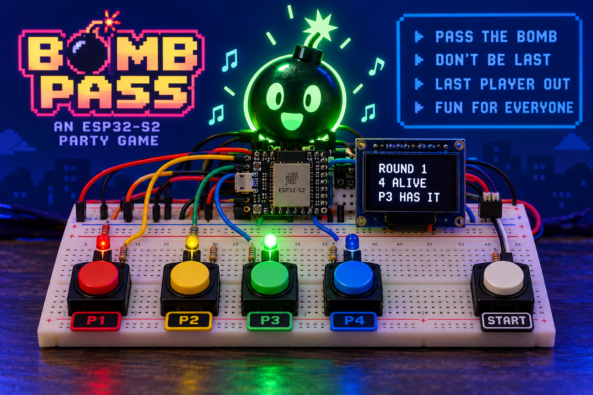
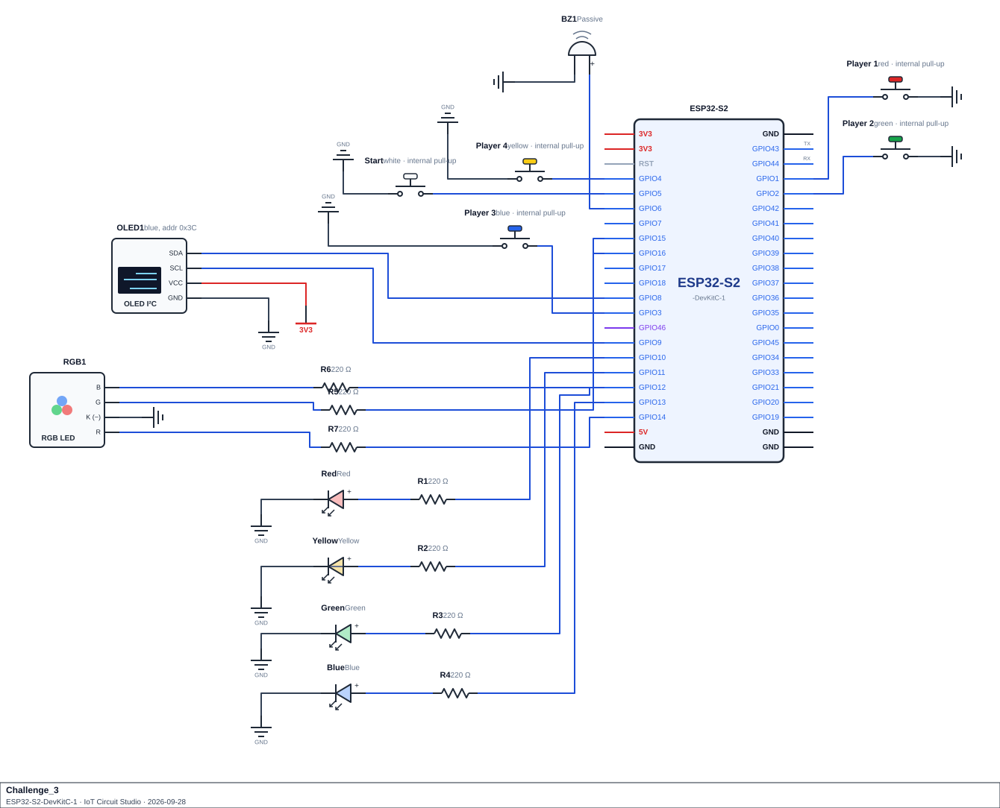

<div align="center">

# Challenge 3

# Bomb Pass: A Four-Player Party Game

</div>

<p align="center">
  
</p>

## Scenario
A youth club has a party game called Bomb Pass. Up to four players sit around the board. Each player has a button and an LED, colour-matched (red, yellow, green and blue), and there is a fifth button labelled Start.

In the lobby, each player presses their button to join (their LED lights up) or leave. Once at least two players have joined, anyone can press Start. A bomb is lit and given to a random player, whose LED comes on. The bomb ticks, and its RGB LED glows green, then yellow, then orange, then red as it burns, while the ticks speed up and rise in pitch. The player holding it has to pass it on by pressing their button, and it goes to a randomly chosen other player. Nobody knows how long the fuse is, because the fuse length is random, so nobody knows who will be holding the bomb when it goes off.

A holder can't just hammer the button: it takes a short moment before a new holder is allowed to pass. And nobody else is allowed to touch their button while someone else holds the bomb. Fidgeting shortens the fuse.

When the bomb explodes, the player holding it is out and their LED flashes. A new bomb is lit for the players who are left, and the game carries on until one player remains: the winner. Wins and explosions are tracked across games, and a ranking sorted by wins is shown at the end.

An OLED screen shows the lobby, who has the bomb, who is out, and the results. The buzzer ticks, beeps for each pass and booms for each explosion.

The whole game runs without a single `delay()` in `loop()`. The ticking, the fuse, the explosion pause and every beep run on timers, so all five buttons stay responsive at once.

## Game Rules
The game is always in one of four states: LOBBY (players joining before a game starts), PLAYING (the bomb is live), EXPLODED (showing the last elimination) or GAME OVER (one player remains).

- In LOBBY, a player's button press toggles them joined/not joined. Start begins a game once `min_players` have joined; otherwise it plays an error tone and stays in LOBBY.
- In EXPLODED, presses are ignored while the pause runs. In GAME OVER, only Start does anything: it returns to LOBBY with everyone still joined.
- In PLAYING, a button press is handled as follows:

| Presser | Trigger | Effect |
|---|---|---|
| Holder | Presses after holding for `min_hold` ms | Passes the bomb to a random other alive player |
| Holder | Presses before `min_hold` ms | Ignored |
| Non-holder (alive) | Presses at any time | Fidget: cuts `fidget_penalty` ms off the fuse, never below 0 |
| Eliminated / unjoined | Presses at any time | Ignored |

Each round's fuse length is random between `fuse_min` and `fuse_max` ms, hidden until it explodes. Reaching the fuse length explodes the bomb: the holder is eliminated, and presses are ignored for `boom_time` ms.

After that pause, a new round starts (a new random holder) if two or more players remain; otherwise the last player alive wins, the game moves to GAME OVER and the ranking rebuilds.

## Components Required
- ESP32-S2 development board
- 5× push button (`INPUT_PULLUP`): four player buttons and one Start button
- 4× LED (red, yellow, green, blue) and 4× 220 Ω resistor, one per player
- RGB LED (common cathode) and 3× 220 Ω resistor, one per colour channel
- Passive buzzer for the ticks and beeps
- SSD1306 OLED display (128×64, I²C) for the game screens
- Jumper wires, breadboard

> **Schematic:**

<p align="center">
  
</p>

> **Keep the four players in the same order everywhere.** Player 1 is the red LED on GPIO10 with the button on GPIO1, player 2 is yellow on GPIO11 with the button on GPIO2, and so on. Your button array, your LED array, your `players[]` array and your `playerTones[]` array must all use this same order, so that index `i` always means the same player. That is also why the ranking sorts player *numbers* and never moves the players themselves (see Requirement 6).

> **Check your RGB LED type before you code.** A common-cathode LED lights when a pin goes high and its shared leg goes to GND. A common-anode LED is the opposite, and a higher `analogWrite()` value makes it dimmer. Wokwi's RGB LED is common cathode by default.

## Functional Requirements

1. **Event log.** `event_log[MAX_EVENTS]` of `GameEvent` (`type`, `player`, `target`, `elapsedMs`, `timestamp`) logging PASS, FIDGET (`target` = `NO_PLAYER`) and EXPLODE. Drop the oldest when full; persists across games.

2. **Inputs and lobby.** One debounced (40 ms) `button_pressed(ButtonState &button)` serves all five buttons via `read_buttons(bool pressed[])`. In the lobby, a press toggles join/leave (LED + beep). Start begins a game once `min_players` have joined, else an error tone. Call `randomSeed(micros())` once, at the first start.

3. **Random numbers and lookup tables**, each returning a checked sentinel:
   - The fuse is random between `fuse_min` and `fuse_max` ms, never shown before it explodes.
   - `pick_random_alive(int exclude, int &chosen)`: equally likely random alive player other than `exclude`; returns `false` if none. Used for the first holder and every pass target.
   - `get_setting(String key)`:

     | Key | Value |
     |---|---|
     | `"fuse_min"` | 8000 ms |
     | `"fuse_max"` | 20000 ms |
     | `"min_hold"` | 300 ms |
     | `"fidget_penalty"` | 750 ms |
     | `"boom_time"` | 2500 ms |
     | `"min_players"` | 2 |

     A missing setting, or `fuse_max` < `fuse_min`, stops the game starting.
   - `get_event_name(int type)`: PASS, FIDGET, EXPLODE.
   - `get_heat_level(unsigned long elapsedMs)`: 0 under 5000 ms, 1 under 10000 ms, 2 under 15000 ms, else 3.

4. **State machine.** Implement the four states and rules from **Game Rules** above. Log every fidget. Print every pass, fidget and explosion to Serial.

5. **Outputs.**
   - **Player LEDs:** joined players lit (lobby), holder only (PLAYING), eliminated player blinks every 150 ms (EXPLODED), winner only (GAME OVER).
   - **RGB LED:** table-driven (`rgbColours[][3]`) via `analogWrite()`, no `if`/`else` chain: lobby (dim blue), heat 0–3 (green/yellow/orange/red), boom (white), winner (purple).
   - **Buzzer:** non-blocking. Ticks while PLAYING from `heatTicks[][]` (600/400/250/150 ms at 600/800/1000/1400 Hz). A pass beeps the receiver's pitch from `playerTones[]` (523/659/784/988 Hz). Join 880 Hz, leave 440 Hz, fidget 300 Hz, error 200 Hz, explosion 120 Hz, win 1319 Hz.
   - Heat tracks time burned, not time left, so the hidden fuse can't be inferred.

6. **Ranking.** `Player` struct (`joined`, `alive`, `wins`, `explosions`) per player in `players[]`. `ranking[]` holds joined player *numbers*, best first, built by insertion sort (more wins, then fewer explosions, then lower player number). Only `ranking[]` is sorted, never `players[]`. Rebuild on every game end and join/leave.

7. **Statistics.** `compute_stats()` gives a `passMatrix[NUM_PLAYERS][NUM_PLAYERS]` of `[who passed][who received]`, totals of passes/fidgets/explosions, the average and longest fuse burn, and the busiest passer (or `NO_PLAYER`). Recompute after every log; guard against divide-by-zero.

8. **Serial report** every 2000 ms: state, round, number alive, per-player table, ranking, statistics, pass matrix, newest 5 events.

9. **OLED** (SSD1306, `Wire.begin(8, 9)`, address `0x3C`). Four player boxes (P1–P4): outlined if joined, filled if holder, struck through if eliminated.
   - **Lobby:** title, join/leave hint, boxes, number joined.
   - **Playing:** round, number alive, holder, boxes, passes this round.
   - **Exploded:** inverse `BOOM!` header, eliminated player, boxes, number alive.
   - **Game over:** inverse `GAME OVER` header, winner, top three of the ranking.

   Redraw on change or every 2000 ms. Game keeps running if the OLED is missing.

10. **No `delay()` in `loop()`.**

## Submission Requirements
- A working Wokwi link with your circuit built and your code loaded and running.
- Your main source file (`.ino` if using the Arduino IDE, or `src/main.cpp` + `platformio.ini` if using PlatformIO).
- Brief written answers to the Reflection Questions below (a few sentences each is enough).

> Once your build works in Wokwi, build the circuit on real hardware and run the same code on it.

>[!NOTE]
> Wokwi link: https://wokwi.com/projects/476095885950320641
> 

## Reflection Questions
Answer these in your own words. They're the kind of question the real Assessment 1 may ask you to justify verbally or in writing:

1. A hidden countdown is shown to the user only in terms of time elapsed, never time remaining. Why does that distinction matter? What could someone work out if the display showed time remaining instead?
   ```


   ```

2. Picking a random item from a subset of eligible candidates (skipping the ones that don't qualify) can be done a few different ways, and not all of them give every candidate an equal chance. Describe an approach that looks reasonable but is actually unfair, and explain why. Separately, why might such a function hand a result back through a reference parameter and return a `bool`, instead of just returning the value directly?
   ```


   ```

3. A classmate implements a timed pause using `delay()` inside the function that starts it. Describe two things that would go wrong, even though input is supposed to be ignored during that pause anyway.
   ```


   ```

4. Several inputs are read into an array each pass, checking every one rather than stopping at the first match. What could go wrong if two inputs occurred at almost the same moment and the program stopped checking after the first one it found?
   ```


   ```

5. Sorting a list of indices that point into an array, rather than sorting the array itself, keeps each record tied to something else (a pin, a position, an identity). Why would sorting the array directly break that link? More generally, what tie-break rules might such a comparison need, and why does a final, deterministic tie-break (such as a fixed ID) matter?
   ```


   ```

6. A 2-D array is used to count how often each pair of items interacts (row = source, column = destination). What should the values on the diagonal always be, and what would a non-zero diagonal value mean? How would you work out the busiest row from the matrix?
   ```


   ```

7. An unsigned integer is decreased by a fixed amount whenever some event happens. What happens if you subtract without checking whether the value has less than that amount left, and how would you prevent it?
   ```


   ```

8. If you were given extra time to extend this game, what would you add, and which earlier topic would it draw on?
   ```


   ```

