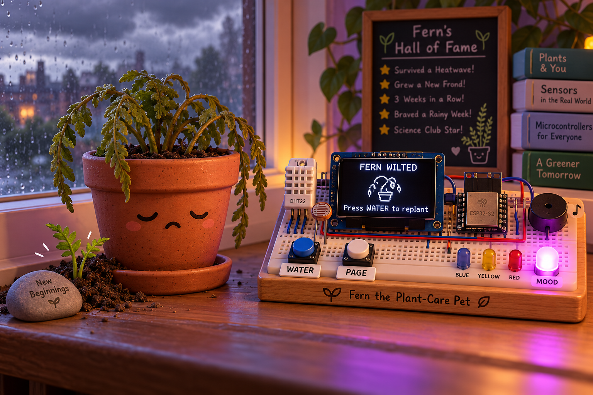
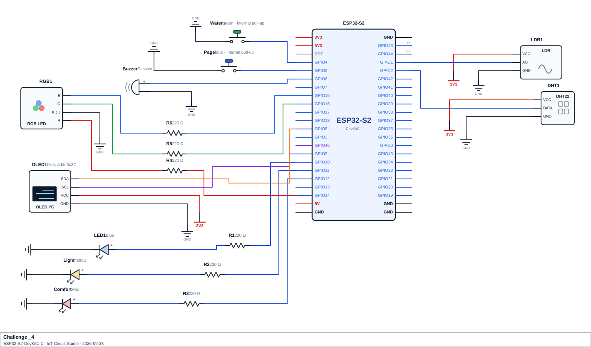

<h1 align="center">Challenge - 4</h1>
<h1 align="center">Fern the Plant-Care Pet</h1>

<p align="center">
  
</p>

## Scenario
A school science club has a virtual plant pet called Fern. Fern lives on a windowsill, and a small device tracks how she is doing. The device has a DHT22 (temperature and humidity) and an LDR (light) sitting next to her, a Water button, a Page button, three warning LEDs, an RGB LED that shows her mood, a buzzer and an OLED screen.

Fern has three needs, each on a scale of 0 to 100:
- **Water** drains a little every second, and drains twice as fast when the air is dry. The only way to refill it is the Water button.
- **Light** rises while the LDR sees good light and falls when the room is dark.
- **Comfort** rises when the temperature is comfortable and falls when it is too cold or too hot.

If a need drops too low, Fern's health drops with it. If her health reaches zero, she wilts and the game is over until someone replants her. While all her needs are fine, she slowly recovers.

Watering has rules. You can't water again within a few seconds of the last time, and if you water a plant that is already full, you rot her roots and lose comfort. From time to time a random event nudges one of her needs: a sunny spell, a rain shower, a cool breeze, aphids, a cloud bank or a hot draught. Nobody knows when the next one will come, or which it will be.

The RGB LED glows from green (thriving) through lime, yellow and orange to red (critical), the buzzer chirps when her mood changes, and each need has a warning LED that lights when it gets low. The OLED shows three pages, cycled with the Page button: a face with her mood and health, the three needs as bars (most urgent first, with a trend arrow), and a page of sensor readings and care statistics. The longest-lived plants go into a hall of fame.

The whole program runs without a single `delay()` in `loop()`. The game tick, both sensors, the random events, the tones and the OLED all run on timers, so the buttons stay responsive at all times.

## Components Required
- ESP32-S2 development board
- DHT22 temperature and humidity sensor and 10 kΩ pull-up resistor
- LDR (photoresistor) module with analog output: Wokwi's *Photoresistor Sensor* (uses its **AO** pin)
- 2× push button (`INPUT_PULLUP`): Water button and Page button
- 3× LED (blue, yellow, red) and 3× 220 Ω resistor for the need warnings
- RGB LED (common cathode) and 3× 220 Ω resistor, one per colour channel
- Passive buzzer for the chirps
- SSD1306 OLED display (128×64, I²C)
- Jumper wires, breadboard

> **Schematic:**

<p align="center">
  
</p>

> **Check your LDR direction before you code.** Different LDR modules read in opposite directions. Wokwi's module gives a high raw value in the dark and a low one in bright light. Before writing `read_brightness()`, print a few raw `analogRead()` values with the lux slider set dark and bright, and confirm which way yours goes.

> **Keep the three needs in the same order everywhere.** Water is need 0 (blue LED), Light is need 1 (yellow LED) and Comfort is need 2 (red LED). Your `needs[]` array, your warning LED array, your name array, your history table and your event table must all use this order, so that index `i` always means the same need. That is also why the most-urgent-first list sorts need *numbers* and never moves the values in `needs[]` (see Requirement 6).

## Functional Requirements

1. **Care log.** `care_log[MAX_CARE]` of `CareEvent` (`type`, `need`, `amount`, `timestamp`). Log every watering, overwatering, event, planting and death; drop the oldest when full. Persists across plants.

2. **Inputs and sensors.**
   - `button_pressed(ButtonState &button)`, debounced 40 ms, serves both buttons; read both every pass.
   - `read_environment(float &tempC, float &humidity)`: reads the DHT22 every 2000 ms via reference params; returns `false` and leaves params untouched on `NaN`. A failed read keeps the last good values and counts as an error.
   - `read_brightness()`: 0-100, read every 500 ms, smoothed via `average_of(const int values[], int count)` over a rolling window of the newest 5 readings (returns 0 for count 0).
   - `randomSeed(micros())` once, on first planting.

3. **Lookup tables**, each checked against a sentinel by its caller:
   - `get_setting(String key)` — `tick_ms` 1000, `water_decay` 0.6, `dry_humidity` 40%, `water_amount` 30, `water_cooldown` 3000, `overwater_limit` 90, `light_good` 50%, `event_min` 15000, `event_max` 45000, `ticks_per_day` 60. Sentinel `-1.0`; a missing key, or `event_max` < `event_min`, blocks planting.
   - `get_comfort_change(float tempC)` — <10°C: -3, <18°C: -1, <26°C: +1, <32°C: -1, else -3. Sentinel `-99.0`.
   - `get_mood(float wellbeing)` — ≥75 THRIVING, ≥50 HAPPY, ≥30 UNEASY, ≥10 WILTING, ≥0 CRITICAL. Sentinel `-1`.
   - `get_mood_name(int mood)` — Thriving, Happy, Uneasy, Wilting, Critical, Seed, Dead. Sentinel `"Unknown Mood"`.

4. **Plant life.** States SEED/ALIVE/DEAD; a tick every `tick_ms` while ALIVE, all changes on-tick only.
   - **Needs** (0-100, clamped, start at 60): Water −`water_decay`/tick (×2 if last valid humidity < `dry_humidity`, else normal rate); Light +1/tick if smoothed brightness ≥ `light_good` else −0.6; Comfort by `get_comfort_change()` on last valid temperature (no change before a first reading).
   - **Health** (0-100, starts 100): −1/tick per need below 20; +0.5/tick if none below 20 and all ≥50; 0 → DEAD.
   - **Wellbeing** = average of the needs, drives mood.
   - **Watering:** refused within `water_cooldown` of the last one (except the very first); at/above `overwater_limit` rots the roots (Comfort −10, no water added); otherwise Water += `water_amount`.
   - **Random events:** after a random `event_min`-`event_max` ms delay, apply a random row below (clamped), log/print it, reschedule. Only while ALIVE.

     | Event | Need | Change |
     |---|---|---|
     | Sunny spell | Light | +20 |
     | Rain shower | Water | +25 |
     | Cool breeze | Comfort | +15 |
     | Aphids! | Comfort | -20 |
     | Cloud cover | Light | -20 |
     | Hot draught | Water | -20 |

   - **Planting:** Water button plants from SEED or replants from DEAD (needs/health/age reset; log and hall of fame kept). Age counts ticks; a day is `ticks_per_day` ticks. Page button cycles the OLED page in any state.

5. **Outputs.**
   - RGB LED: colour from 2-D `moodColours[][3]` (row = mood) via `analogWrite()`, no `if`/`else` chain. Suggested: thriving (0,255,0), happy (150,255,0), uneasy (255,200,0), wilting (255,80,0), critical (255,0,0), seed (40,40,40), dead (120,0,200).
   - Mood tones: on mood change, play the row of 2-D `moodTones[][2]` (freq, ms), no `if`/`else` chain. Suggested: thriving 1319/120, happy 1047/100, uneasy 587/150, wilting 330/200, critical 196/300, seed 784/100, dead 100/800.
   - Warning LEDs: lit (via loop, not per-LED `if`) when a need is below 30, only while ALIVE.
   - Critical tone repeats every 5 s while mood is CRITICAL.
   - Other tones (non-blocking, start/stop via `loop()`): water 880/80, overwater 200/300, event 660/120, error 150/100, planting 1047/150.

6. **Sorted structures.**
   - `urgency[]`: need numbers sorted lowest-first, insertion sort in `rank_needs()`, ties to the lower number, one comparison function. Rebuilt on every need change (tick, watering, event, planting). Sorts the indices only, never `needs[]`.
   - `hallOfFame[]`: top `MAX_RECORDS` (3) lives (`LifeRecord`: `ticks`, `timestamp`) via `add_life_record()`, insertion-sorted longest-first (ties favour the earlier), no full re-sort. Full hall discards a non-longer life or bumps the last entry. Returns the new rank or `-1`; called once per death.

7. **History, trends and statistics.**
   - `needHistory[NUM_NEEDS][HISTORY_LEN]` (10 ticks), oldest dropped when full.
   - `get_trend(int need)`: `+1`/`-1` for a >2 rise/fall between oldest and newest, else `0` (including before full).
   - `compute_stats()`: care-type counts, `eventImpact[NUM_NEEDS][2]` (helped/harmed), average watering gap (needs ≥2 waterings), most-harmed need (`NO_NEED` if none). Recompute after every log; guard divide-by-zero.

8. **Serial report** every 2000 ms: state/day/mood/health; needs in urgency order with trend; environment readings (or waiting message) and sensor error count; care counts, average watering gap, most harmed need; event impact table (nested loops); hall of fame; newest 5 care events.

9. **OLED** (SSD1306, `Wire.begin(8, 9)`, `0x3C`).
   - Pet page: day, mood name, mood face (`^_^`,`:)`,`:|`,`:(`,`T_T`,`(.)`,`x_x`), health as number + bar (`map()`), most urgent need + value, last event.
   - Needs page: three rows in urgency order — name, bar, value, trend arrow (`^`/`v`/`-`).
   - World page: temperature/humidity (or waiting message), smoothed light %, watering/overwatering/event counts, sensor errors.
   - Seed screen: pet name + `Press WATER to plant`.
   - Dead screen: inverse header, days/ticks lived, hall of fame rank (or `Not in hall of fame`), `Press WATER to replant`.
   - Redraw on change or every 2000 ms, ending with `display.display()`. Missing OLED doesn't stop the game.

10. **No `delay()` in `loop()`.**

## Submission Requirements
- A working Wokwi link with your circuit built and your code loaded and running.
- Your main source file (`.ino` if using the Arduino IDE, or `src/main.cpp` + `platformio.ini` if using PlatformIO).
- Brief written answers to the Reflection Questions below (a few sentences each is enough).
  >Once your simulation is working, build the circuit on real hardware and confirm it behaves the same way. A photo or short video of the working build is enough evidence.

>[!NOTE]
> Wokwi link: https://wokwi.com/projects/476104834435059713

## Reflection Questions
Answer these in your own words. They're the kind of question the real Assessment 1 may ask you to justify verbally or in writing:

1. This build smooths a sensor reading with a rolling average of the last few readings instead of reacting to the newest one. What would happen if something briefly blocked or disturbed the sensor for a single reading, and the logic reacted to the newest reading only? What does the size of the averaging window trade off?
   ```


   ```

2. One of the sensor-reading functions returns a `bool` and hands its values back through reference parameters, rather than returning a single value directly. Suppose instead it just returned the value, and the caller stored whatever came back, including an invalid reading. Trace what would happen to the state it feeds over the next few ticks.
   ```


   ```

3. State changes happen once per tick on a `millis()` timer, not once per pass of `loop()`. How many times does `loop()` run per second on this board, and what would happen if the change were applied on every pass instead? Also, what goes wrong if the tick is done with `delay()`?
   ```


   ```

4. One of the sorted lists in this build sorts an array of indices or keys rather than sorting the underlying data array itself. Why would sorting the data array directly break the program? Why does the sorted list also need to be rebuilt whenever the underlying data changes, and not only on a fixed schedule?
   ```


   ```

5. Identify the things in this build that are randomised. For each one, explain what a user could do differently if it were fixed instead of random (for example, always the same outcome, or always the same timing).
   ```


   ```

6. One of this build's rules combines a cooldown with an upper-limit guard on the same action. What problem does each one solve on its own? Also explain why the code needs a separate flag to track whether the action has ever happened before, instead of just comparing elapsed time against the cooldown on the very first attempt.
   ```


   ```

7. Pick one cell of a 2-D history table in this build and describe what it holds. Why does trend or threshold logic use a margin rather than reporting a change whenever the newest value is even slightly different from the oldest?
   ```


   ```

8. If you were given extra time to extend this build, what would you add, and which earlier topic would it draw on?
   ```


   ```
