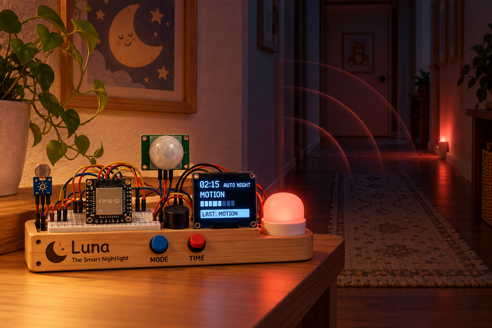
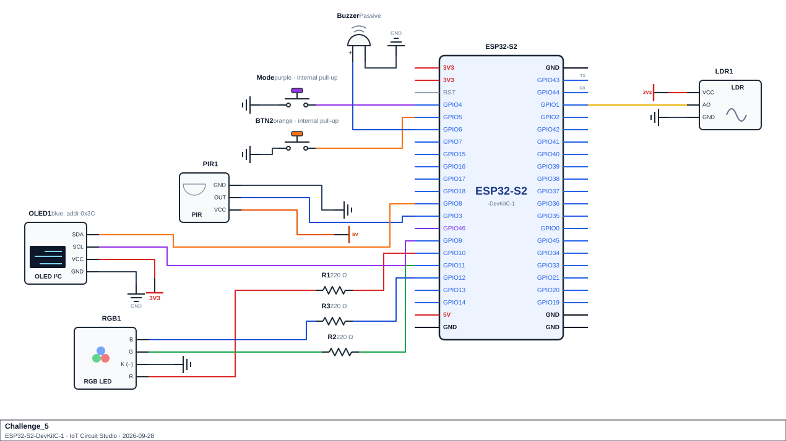

<h1 align="center">Challenge 5</h1>
<h1 align="center">Luna the Smart Nightlight</h1>
<p align="center">
  
</p>

## Scenario
A family wants a smart nightlight for the hallway outside a child's bedroom. It is called Luna. An LDR measures how dark the hallway is, a PIR sensor notices anyone walking past, and an RGB LED is the lamp. Two buttons let a parent change how Luna behaves. An OLED shows what she is doing.

Luna follows a sleep schedule. In the early evening she glows a warm white while the hallway is dark. As bedtime approaches she dims to a gentle amber. Through the night she stays off, but if someone walks past she fades up a very dim red light (red doesn't ruin night vision) and fades out again a few seconds after the movement stops. In the morning she works as a sunrise lamp, slowly brightening from nothing to a warm glow, whatever the light in the hallway. During the day she stays off.

A real schedule would take 24 hours to test, so Luna has a simulated clock. It runs fast (a whole day passes in a couple of minutes), and a Time button jumps it forward by half an hour so you can reach any time of day quickly.

Two things stop Luna from behaving badly. First, the darkness decision has a gap: she decides the hallway is dark below one brightness level, but doesn't decide it is light again until it is above a higher one, so a reading hovering near the limit doesn't make the lamp flicker. Second, the light sensor is noisy, so Luna uses the middle value of the last few readings rather than the newest, and a single flash of a torch or a car's headlights doesn't fool her.

The Mode button switches between AUTO (follow the schedule), ON (always a steady glow) and OFF (always dark). Every night Luna keeps a summary of how many times someone moved and how long she was lit, and ranks the nights, quietest first.

The whole program runs without a single `delay()` in `loop()`. The clock, the sensors, the fade and the tones all run on timers, so the buttons and the PIR stay responsive at all times.

## Components Required
- ESP32-S2 development board
- LDR (photoresistor) module with analog output: Wokwi's *Photoresistor Sensor* (uses its **AO** pin)
- PIR sensor (movement in the hallway)
- 2× push button (`INPUT_PULLUP`): Mode button and Time button
- RGB LED (common cathode) and 3× 220 Ω resistor, one per colour channel
- Passive buzzer for the chimes
- SSD1306 OLED display (128×64, I²C)
- Jumper wires, breadboard

> **Schematic:**

<p align="center">
  
</p>

> **Check your LDR direction before you code.** Different LDR modules read in opposite directions. Wokwi's module gives a high raw value in the dark and a low one in bright light. Before writing `read_brightness()`, print a few raw `analogRead()` values with the lux slider set dark and bright, and confirm which way yours goes.

> **Check your RGB LED type before you code.** A common-cathode LED lights when a pin goes high and its shared leg goes to GND. A common-anode LED is the opposite, and a higher `analogWrite()` value makes it dimmer. Wokwi's RGB LED is common cathode by default.

## Functional Requirements

1. **Event log.** Log every movement, lamp-on, lamp-off, mode change, period change and clock change to an array of structs (type, value, day, minute, timestamp). Drop the oldest record when full.

2. **Inputs and sensors.** One debounced function serves both buttons. Read brightness (0-100, rising with light) every 200 ms into a rolling window of the newest 7 readings, and drive all darkness logic from its median. Treat each PIR rising edge as one movement; movement counts as recent for a set hold time afterward.

3. **Schedule and lookup tables.** A settings lookup and a sorted table of periods (start time, base level, movement level, colour, dark-only flag, ramp flag) drive the schedule. A period-finder hands back the period and minutes-into it by reference, handling the wrap past midnight, and returns false for an invalid input. Mode names, event names and a zero-padded time formatter round out the lookups. Every lookup returns a checked sentinel when a key isn't found.

4. **Clock and lamp logic.** A simulated clock ticks forward on a timer, wraps at midnight, and can be jumped forward by a button. Period changes are logged and chimed; entering/leaving the night period starts/ends that night's counters. Darkness uses two thresholds (hysteresis) so it doesn't flicker near the limit. The target lamp level follows the mode (off, steady-on, or automatic), with automatic mode following the period's level, ramping up during a sunrise period, and switching to a higher level when movement is recent. The lamp fades toward its target without overshooting or blocking.

5. **Outputs.** Lamp colour and brightness come from a 2-D colour table scaled by level; mode-change and period-start tones come from 2-D tone tables, chosen without an `if`/`else` chain. All tones are non-blocking.

6. **Sorted structures.** The median filter insertion-sorts a copy of its readings (never the original) and returns the middle value. A "best nights" list of a fixed size stays sorted by insertion after every finished night, ranked by fewer movements then less lamp time.

7. **Statistics.** Live per-period counters track movements and lamp-on minutes. A separate function derives movements-by-hour, the busiest hour, the average gap and the longest quiet stretch between movements from the log, correct across midnight and safe against dividing by zero.

8. **Serial report**, on a timer: the clock, period and mode; light/darkness/motion state; lamp levels; the period table; the statistics; the best nights; and the newest events.

9. **OLED.** Show the clock, mode and period; the lamp level as a bar and percentage; the light level with dark/bright and motion status; and the latest event, in inverse video when the lamp is lit by recent motion. Redraw on change or on a timer, and keep running if the OLED is missing.

10. **No `delay()` in `loop()`.**

## Submission Requirements
- A working Wokwi link with your circuit built and your code loaded and running.
- Your main source file (`.ino` if using the Arduino IDE, or `src/main.cpp` + `platformio.ini` if using PlatformIO).
- Brief written answers to the Reflection Questions below (a few sentences each is enough).
  >Once your simulation is working, build the circuit on real hardware and confirm it behaves the same way. A photo or short video of the working build is enough evidence.

>[!NOTE]
> Wokwi link: https://wokwi.com/projects/476106330962228225
## Reflection Questions
Answer these in your own words.

1. A dark/light decision can use one threshold or two (a hysteresis gap). What would a reading hovering near a single threshold do to an output that reacts to it? Why does a two-threshold decision have to remember its previous state?
   ```


   ```

2. A median filter is one way to smooth a noisy sensor; an average and "use the newest reading" are two others. Give an example of a reading pattern where the median stays sensible but the average doesn't. Also, why should a median filter sort a copy of the readings rather than the rolling window itself?
   ```


   ```

3. When a lookup finds which period of a day a given time falls into, what should happen for a time that belongs to a period which started the evening before (i.e. before the first period's start time)? What would go wrong if you assumed every period ends exactly when the next one starts, with no wrap past midnight?
   ```


   ```

4. A lookup function hands back a result and a "how far into it" value through reference parameters, and returns a `bool`. Why is that a better design than returning only the one value and working out the rest somewhere else? What does the `bool` tell the caller?
   ```


   ```

5. A classmate fades an output with a `for` loop that changes the level by a fixed step and calls `delay()` between steps. Describe two things that would go wrong elsewhere in the program while a fade like that is happening. Also, why must a non-blocking fade check that it doesn't overshoot its target?
   ```


   ```

6. "Recent" is often worked out with `millis() - lastEvent < hold`, alongside a flag that marks whether the event has happened at all yet. Why is the subtraction written that way round, rather than `millis() < lastEvent + hold`? What would the flag prevent when the board first powers up?
   ```


   ```

7. A logged event can store a day number as well as a minute of the day. Why is that needed to work out the gap between two events either side of midnight? What would a "longest gap" calculation come out as if it only used the minute of the day?
   ```


   ```

8. If you were given extra time to extend this device, what would you add, and which earlier topic would it draw on?
   ```


   ```
