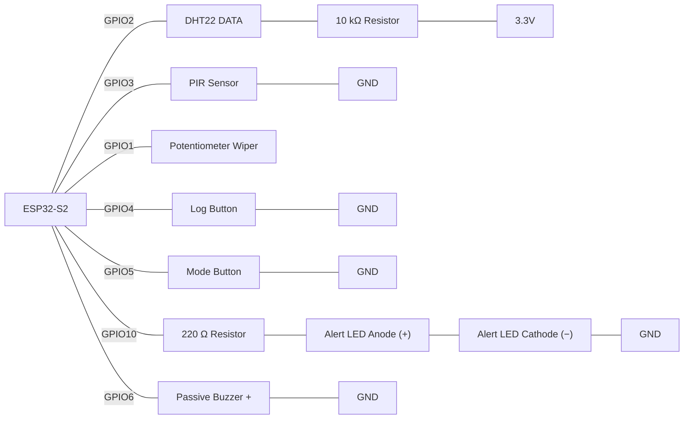

# Practice - Warehouse Loading Dock Station

## Introduction
This practice activity asks you to design and build a single, non-blocking IoT device that draws together everything covered so far: variables and selection, functions, reading multiple sensors, `millis()`-based timing, arrays, and structured data via structs and lookup tables. Rather than testing these ideas one at a time, it expects you to combine them into one coherent program the way a real embedded project would.


## Scenario
A warehouse loading dock needs a self-contained environmental and safety monitoring station. It watches ambient temperature/humidity (spoilage-sensitive goods pass through the dock) and forklift/pedestrian motion, lets a dock supervisor log a manual "spot check" reading of ambient light level on demand (used as a rough after-hours tamper check), and raises a visible/audible alert whenever any logged reading crosses a threshold defined for its sensor all while a running Serial report keeps the supervisor informed of the station's statistics and lets them flip between a chronological view and a by-value view of everything logged so far.

This single station is deliberately built to require **every major concept covered so far**, combined into one coordinated program rather than tested in isolation:

| Concept | Where it shows up in this build |
|---|---|
| Variables, `setup()`/`loop()`, digital output | Pin configuration, LED/buzzer output |
| Functions | Every distinct piece of behaviour is its own named function |
| Reading inputs, selection (`if`/`else`) | Button/PIR reads; threshold-breach decision logic |
| Combining multiple sensors, non-blocking `millis()` timing | Whole program runs without a single `delay()` in `loop()` |
| Arrays, loops, sorting | The reading log; insertion sort on every insert; a **single-pass scan** for min/max/average |
| Structs, key-value lookup tables | `DockReading` struct log kept sorted on insert; a `Threshold` lookup table (by sensor name) |

## Expected Outcome
When your circuit and code are running correctly on Wokwi, you should be able to observe:

- **Startup:** Serial report prints every ~2000 ms; reading count climbs as readings log.
- **Automatic readings:** temperature + humidity log every 2000 ms; failed DHT22 reads are skipped, never logged as `nan`.
- **Motion:** one `"motion"` reading per PIR transition into motion, not while held.
- **Manual spot check:** Log button logs the potentiometer's current value as `"light"`.
- **Mode toggle:** Mode button flips the report between chronological and value-sorted order, without altering the underlying log.
- **Alerts:** a threshold breach flashes the LED and buzzer (~300 ms) without pausing the rest of the program.
- **Running statistics:** temperature min/max/average update after each temperature reading only.
- **No stalling:** buttons, PIR, and the report all respond immediately at all times.

Example Serial output during normal operation:


```
--- Dock Report ---
Time order | n=4 | temp min=18.2 max=24.6 avg=21.4
[2000] temperature: 18.20 C
[2000] humidity: 55.00 %
[4000] temperature: 24.60 C
[4000] humidity: 58.00 %
--------------------
```

After pressing the Mode button, the same readings print reordered by value instead of by timestamp:

```
--- Dock Report ---
Value order | n=4 | temp min=18.2 max=24.6 avg=21.4
[2000] humidity: 55.00 %
[4000] humidity: 58.00 %
[2000] temperature: 18.20 C
[4000] temperature: 24.60 C
--------------------
```
## Components Required
- ESP32-S2 development board
- DHT22 sensor (ambient temperature + humidity)
- 10 kΩ resistor (DHT22 pull-up)
- PIR sensor (dock motion — forklifts/pedestrians)
- Potentiometer (simulates a light-level sensor for manual spot checks)
- 2× push button (`INPUT_PULLUP`) — Log button, Mode button
- 1× LED + 220 Ω resistor — alert indicator
- Passive buzzer alert tone
- Jumper wires, breadboard

> **Wiring:**


>[!NOTE]
> Starter/reference circuit — open and fork this to begin: https://wokwi.com/projects/474646049434572801

## Build Order
The functional requirements below are listed by topic, not by build order — attempting them top-to-bottom will have you writing alert and statistics logic before you've ever seen a sensor value on Serial. Build incrementally instead:

1. **Wire it up and read raw values.** Get the DHT22, PIR, potentiometer, and both buttons reading and printing to Serial on a `millis()` timer — no `delay()`, no logging yet. This gets the non-blocking timing pattern working before anything else depends on it.
2. **Log without sorting.** Add the `DockReading` struct and `log_reading()`, but just append — don't worry about insertion sort yet. Get automatic temperature/humidity/motion logging (Requirement 2) working correctly first.
3. **Add the insertion sort step** to `log_reading()` (finishing Requirement 1) — now every insert bubbles left past later timestamps.
4. **Manual spot check.** Edge-detect the Log button to log the potentiometer's current value as a `"light"` reading (part of Requirement 3).
5. **Mode toggle.** Edge-detect the Mode button to toggle `sortByValue`, and confirm it only changes what's displayed — the underlying log stays in timestamp order (finishing Requirement 3).
6. **Build the Threshold lookup table** (Requirement 4) and test `get_threshold()` on its own with known and unrecognised sensor names before wiring it into anything else.
7. **Alert output.** Wire `get_threshold()` into a non-blocking LED/buzzer alert (Requirement 5).
8. **Running statistics, then report.** Add `compute_stats()` (Requirement 6), then the Serial `report()` covering both display modes (Requirement 7).
9. **Final pass:** search your whole program for `delay()` outside `setup()` (Requirement 8) and confirm the PIR, both buttons, and the report all keep responding during an active alert.

## Functional Requirements

**1. Structured, sorted logging.**
`struct DockReading { String sensor; float value; String unit; unsigned long timestamp; };`, stored in `DockReading readings[MAX_READINGS]` (size `MAX_READINGS` generously, e.g. 50, so overflow won't realistically occur during testing). `log_reading()` inserts new records in timestamp order via insertion sort.

**2. Automatic sensor readings (non-blocking).**
Every 2000 ms (the DHT22's minimum read interval), read and log temperature and humidity (`isnan()`-guarded). Edge-detect the PIR and log one `"motion"` reading per transition into motion.

**3. Manual spot-check logging.**
Edge-detect the Log button to log a `"light"` reading from the potentiometer. Edge-detect the Mode button to toggle `bool sortByValue`, switching the display between chronological and value-sorted order without reordering the underlying log.

**4. Dictionary-style alert thresholds.**
`struct Threshold { String sensor; float limit; };` table for `"temperature"`, `"humidity"`, `"light"`. `get_threshold(String sensor)` does a linear search, returning the limit or a `-1.0` sentinel if not found.

**5. Alert output.**
On a threshold breach, light the LED and sound the buzzer for 300 ms without blocking `loop()`.

**6. Running statistics.**
`compute_stats()` scans the log in one pass to find min/max/average `.value` for a single sensor type, recomputed after every log.

**7. Non-blocking Serial report.**
`report()` prints reading count, display mode, and temperature min/max/average, running every 2000 ms via `millis()`.

**8. No `delay()` in `loop()`.**
All timing uses `millis()`.

## Testing Tips
- Click the PIR sensor's icon in the simulator to trigger one motion edge; clicking repeatedly should log one `"motion"` reading per click, not a flood of them.
- Drag the potentiometer knob, then press the Log button to confirm it logs a `"light"` reading at that exact value.
- Push the DHT22's temperature/humidity sliders or the potentiometer past your thresholds to confirm each sensor type triggers the alert independently.
- Remember the DHT22 only updates roughly every 2 seconds — rapid changes to its sliders won't produce faster readings than that.
- Press the Mode button and confirm the reading count stays the same before and after — only the print order should change, never the underlying log.
- Watch the Serial Monitor throughout; alerts should name the sensor that triggered them, not just say "ALERT".

## Submission Requirements
- A working Wokwi link with your circuit built and your code loaded and running.
- Your main source file (`.ino` if using the Arduino IDE, or `src/main.cpp` + `platformio.ini` if using PlatformIO).
- Brief written answers to the Reflection Questions below (a few sentences each is enough).

>[!IMPORTANT]
> Wokwi link: _(**Finished:** https://wokwi.com/projects/475566023683273729)_

## Self-Assessment Checklist
- [ ] `DockReading` struct groups `sensor`, `value`, `unit`, `timestamp`; the log is one array of these, not parallel arrays
- [ ] `log_reading()` keeps the array sorted by timestamp via insertion (bubbling only the new record), not a full re-sort
- [ ] DHT22 reads are `isnan()`-guarded and 2000 ms apart; PIR motion is edge-detected, not logged on every pass while held
- [ ] Both buttons are edge-detected; Log adds a spot-check reading, Mode toggles the display view without corrupting the underlying sorted log
- [ ] `get_threshold()` returns a checked sentinel for an unrecognised sensor name
- [ ] Alerts (LED + buzzer) are triggered by a real threshold comparison and timed with `millis()`, never `delay()`
- [ ] `compute_stats()` scans one sensor type's values in a single pass, correctly initialised (not from `0`)
- [ ] `report()` runs on a `millis()` heartbeat and never blocks the rest of `loop()`
- [ ] No `delay()` appears anywhere inside `loop()` or any function it calls
- [ ] Code is broken into named functions — no single giant `loop()` doing everything inline

## Reflection Questions
Answer these in your own words.

1. Why does this build use one `DockReading` struct array instead of separate arrays per sensor type (one for temperature, one for humidity, one for light)?
   ```
    Because all the readings have the same structure, we can use one DockReading array instead of managing three separate arrays. This makes the data more organised and easier to manage, read, and understand.

   ```

2. Your `get_threshold()` function must return a sentinel for a sensor name it doesn't recognise. Walk through what would go wrong in the alert logic if it returned `0` instead of a negative sentinel.
   ```
    That way get_threshold() uses -1 to show that no threshold was found. If it returned 0 instead, the program could treat 0 as a valid threshold and trigger a false alert when the sensor value is greater than 0.

   ```

3. Why must the value-sorted display mode avoid permanently reordering the underlying log array?
   ```
    Because the program should keep the readings in timestamp order as the original log, while changing the display order is just a user preference.

   ```

4. Identify every place in your program where `millis()`-based timing is used instead of `delay()`, and explain what would break in each case if `delay()` were used instead.
   ```
    We used millis() for the DHT22 timing, report timing, button debounce, reading timestamps, and the LED/buzzer alert duration. If we used delay() in one part of the project it will stop the whole project even though we only want to stop one part of it.

   ```

5. `compute_stats()` must scan only one sensor type's values, not the whole log indiscriminately. What would an average that mixed temperature, humidity, and light values together actually mean — and why is that a problem?
   ```
    Because compute_stats() only counts the temperature readings instead of averaging all the readings together. If we averaged all the readings together, it would produce a useless number because each reading type is different.

   ```

6. If you were given one more week to extend this station, what would you add, and which past week's concept would it draw on?
   ```
    If I were given another week, I would extend the project by adding an OLED display that shows the current status. This would give the workers a quick idea of the environment around them and would use the OLED display concept from previous weeks.

   ```


