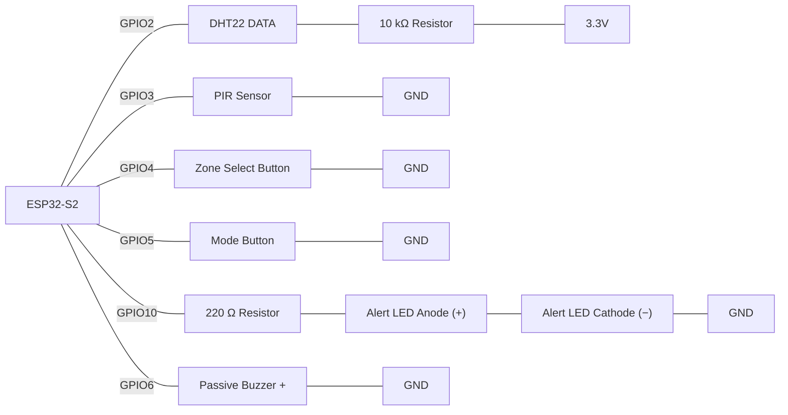

# Practice - Chemical Storage Multi-Cabinet Access & Tamper Monitor

## Introduction
In this activity you'll build a coordinated IoT monitoring station for a school science prep room: three chemical storage cabinets watched for a suspicious pattern of access, alongside simple ambient temperature/humidity safety monitoring. The build brings together structured logging, sorting, lookup tables, selection logic, and non-blocking timing into one program running on a single ESP32-S2, rather than treating each concept as an isolated exercise.

## Scenario
A school science prep room has **three separate chemical storage cabinets** (Acid, Flammables, Oxidiser) that must be monitored for both environmental safety and unauthorised access. A single PIR sensor sits at the prep bench and represents whichever cabinet a technician has currently selected with a Zone Select button — every motion event it detects is logged against that cabinet. Rather than raising an alarm the instant *any* single access happens (which would make the alert useless — technicians legitimately open cabinets all the time), the station instead watches for a **suspicious pattern**: a cabinet accessed an unusually high number of times in a short rolling window, which is what real tampering or repeated unauthorised access would actually look like. Ambient temperature/humidity around the storage area is still monitored on its own simple threshold, since heat and damp genuinely do threaten stored reagents regardless of who's opening what. A Mode button lets the technician flip the running Serial report between an overview of all three cabinets and a detailed view of whichever cabinet is currently selected.

This single station is deliberately built to require **every major concept covered so far**, through a different core mechanic than a simple value-over-threshold check:

| Concept | Where it shows up in this build |
|---|---|
| Variables, `setup()`/`loop()`, digital output | Pin configuration, LED/buzzer output |
| Functions | Every distinct piece of behaviour is its own named function |
| Reading inputs, selection (`if`/`else`) | Button/PIR reads; tamper-rate and ambient-threshold decision logic |
| Combining multiple sensors, non-blocking `millis()` timing | Whole program runs without a single `delay()` in `loop()` |
| Arrays, loops, sorting | The event log; a **windowed scan** counting recent events per zone; a **tally-and-find-the-largest** scan for the busiest zone |
| Structs, key-value lookup tables, insertion sort | `StationReading` struct log kept sorted on insert; **two** lookup tables — `Threshold` (by sensor name) and `ZoneInfo` (by zone number) |

## Expected Outcome
When your build is complete, it should behave like this on the bench:
- Pressing the Zone Select button cycles the selected cabinet Acid → Flammables → Oxidiser → Acid, visible in the Serial output.
- A fresh temperature/humidity reading logs automatically roughly every 2 seconds, with no button press needed.
- Triggering the PIR logs exactly one access event against whichever cabinet is currently selected — holding the PIR continuously does not log repeatedly.
- Triggering the PIR three or more times against the same cabinet within about 10 seconds lights the LED and sounds a short buzzer tone — the tamper alert, named to the correct cabinet.
- A temperature or humidity reading over its threshold fires the same LED/buzzer alert, independently of any access pattern.
- While an alert is sounding, the PIR, both buttons, and the periodic sensor readings all keep responding — nothing pauses or freezes.
- Pressing the Mode button toggles the Serial report between an overview of all three cabinets' tallies (with the busiest one named) and a detailed view of just the currently selected cabinet.
- Nothing in the program ever blocks with `delay()` — Serial output, sensor timing, and alerts all run concurrently and continuously.

## Components Required
- ESP32-S2 development board
- DHT22 sensor (storage area ambient temperature + humidity)
- 10 kΩ resistor (DHT22 pull-up)
- PIR sensor (access detection at whichever cabinet is currently selected)
- 2× push button (`INPUT_PULLUP`) — Zone Select button, Mode button
- 1× LED + 220 Ω resistor — alert indicator
- Passive buzzer — alert tone
- Jumper wires, breadboard

> **Wiring:**



## Build Order
The functional requirements below are listed by topic, not by build order — attempting them top-to-bottom will have you writing the tamper-detection logic before you've ever seen a sensor value on Serial. Build incrementally instead:

1. **Wire it up and read raw values.** Get the DHT22, PIR, and both buttons reading and printing to Serial on a `millis()` timer — no `delay()`, no logging yet. This gets the non-blocking timing pattern working before anything else depends on it.
2. **Zone selection.** Edge-detect the Zone Select button and cycle `currentZone` (0→1→2→0). Print the current zone so you can confirm it changes correctly.
3. **Log without sorting.** Add the `StationReading` struct and `log_reading()`, but just append — don't worry about insertion sort yet. Get ambient readings (Requirement 2) and access events logging correctly first.
4. **Add the insertion sort step** to `log_reading()` (finishing Requirement 1) — now every insert bubbles left past later timestamps.
5. **Build the two lookup tables** (Requirement 3) and test `get_threshold()` / `get_zone_name()` on their own with known inputs, including an unrecognised key, before wiring them into anything else.
6. **Ambient alert first.** Wire `get_threshold()` into a non-blocking LED/buzzer alert (Requirement 5) — this is the simpler of the two alert triggers (one reading vs. one limit) and gets the shared alert mechanism working.
7. **Tamper detection.** Add `count_recent_access()` (Requirement 4) and route it into the *same* alert path you already built — this is the core mechanic and the hardest part, so it's easiest once the alert plumbing already works.
8. **Per-zone stats** (Requirement 6), then **Mode toggle + report()** (Requirement 7).
9. **Final pass:** search your whole program for `delay()` outside `setup()` (Requirement 8) and confirm the PIR, both buttons, and the sensor timer all keep responding during an active alert.

## Functional Requirements

**1. Structured, sorted logging.**
`struct StationReading { String sensor; float value; String unit; unsigned long timestamp; int zone; };` (`zone` is `-1` for ambient readings, `0`–`2` for `"access"` events), stored in `StationReading readings[MAX_READINGS]` with a `reading_count`. `log_reading()` inserts new records in timestamp order via insertion sort; when full, drop the oldest record to make room.

**2. Zone selection + automatic sensor readings (non-blocking).**
Edge-detect the Zone Select button to cycle `currentZone` (`0 → 1 → 2 → 0`) — it never logs a reading itself. Every 2000 ms, read and log temperature and humidity as separate `zone = -1` records (`isnan()`-guarded). Edge-detect the PIR and log one `"access"` record (`zone = currentZone`) per transition into motion.

**3. Two dictionary-style lookup tables.**
`struct Threshold { String sensor; float limit; };` for `"temperature"` and `"humidity"`, searched by `get_threshold(String sensor)` (sentinel `-1.0`). `struct ZoneInfo { int zone; String name; };` for the three cabinets, searched by `get_zone_name(int zone)` (sentinel `"Unknown Zone"`). Every caller checks the sentinel before use.

**4. Event-rate tamper detection — the core mechanic.**
`count_recent_access(int zone, unsigned long windowMs)` re-scans the whole log, counting `"access"` records for that zone within the last `windowMs` of `millis()`. After each new access event, call it with a **10000 ms** window; **3 or more** triggers the alert, naming the cabinet via `get_zone_name()`.

**5. Ambient threshold alert + non-blocking alert output.**
A temperature/humidity reading over its `Threshold` also triggers the alert, sharing the same non-blocking mechanism as tamper detection: LED + `tone()` for 300 ms, without blocking `loop()`.

**6. Per-zone running statistics.**
`compute_zone_stats()` scans the log once, tallying `"access"` events into `zoneAccessCount[3]`, then finds the index of the largest count (the busiest cabinet). Recompute after every new log.

**7. Non-blocking Serial report + display mode toggle.**
Edge-detect the Mode button to toggle `bool showAllZones`. `report()` runs at least every 2000 ms via `millis()`, printing all cabinets + the busiest (`true`) or just the selected cabinet's name and recent access count (`false`). The toggle changes only what is printed.

**8. No `delay()` in `loop()`.**
All timing — sensor polling, tamper window, alert duration, report heartbeat — uses `millis()`.

## Testing Tips 
- Click the PIR sensor's icon in the simulator to trigger one motion edge. Click it 3+ times against the same selected zone within about 10 real seconds to trigger the tamper alert — Wokwi runs in real time, so the window really does take that long.
- Use the DHT22's control panel (click the sensor) to drag its temperature/humidity values above your threshold and confirm the ambient alert fires independently of any PIR activity.
- Remember the DHT22 only updates roughly every 2 seconds — rapid clicking on its sliders won't produce faster readings than that.
- Watch the Serial Monitor throughout testing; both alert types should name the cabinet or sensor that triggered them, not just say "ALERT".

## Submission Requirements
- A working Wokwi link with your circuit built and your code loaded and running.
- Your main source file (`.ino` if using the Arduino IDE, or `src/main.cpp` + `platformio.ini` if using PlatformIO).
- Brief written answers to the Reflection Questions below (a few sentences each is enough).

>[!NOTE]
> Wokwi link: https://wokwi.com/projects/475226916329119745

**Finished:** https://wokwi.com/projects/475663275302780929

## Self-Assessment Checklist
- [ ] `StationReading` struct groups `sensor`, `value`, `unit`, `timestamp`, `zone`; the log is one array of these, not separate arrays per cabinet
- [ ] `log_reading()` keeps the array sorted by timestamp via insertion (bubbling only the new record), not a full re-sort
- [ ] When the log is full, the oldest record is dropped to make room for the new one, rather than the new reading being silently discarded or writing past the array
- [ ] Zone Select button is edge-detected and only changes `currentZone` — it never logs a reading by itself
- [ ] DHT22 reads are `isnan()`-guarded and 2000 ms apart (`zone = -1`); PIR access is edge-detected and tagged with `currentZone`, not logged on every pass while held
- [ ] `get_threshold()` and `get_zone_name()` both return a checked sentinel for an unrecognised key, and every caller checks it before use
- [ ] `count_recent_access()` genuinely re-scans the log for matching `"access"` records inside the time window — it isn't just comparing the last two timestamps
- [ ] A zone reaching the tamper limit within the window triggers the same non-blocking alert path as an ambient threshold breach
- [ ] `compute_zone_stats()` counts only `"access"` records (never temperature/humidity) when tallying per zone
- [ ] Mode toggles what `report()` prints only — the underlying `readings[]` array is never filtered, reordered, or mutated by it
- [ ] No `delay()` appears anywhere inside `loop()` or any function it calls
- [ ] Code is broken into named functions — no single giant `loop()` doing everything inline

## Reflection Questions
Answer these in your own words they're the kind of question the real Assessment 1 may ask you to justify verbally or in writing:

1. Why does this build store `zone` as a field on one shared `StationReading` array instead of keeping three separate arrays, one per cabinet?
   ```
    Because each array has the same structure, we can store them in one shared array instead of having three separate arrays. This is more organised and easier to manage and read.

   ```

2. `count_recent_access()` re-scans the whole log every time it's called, rather than just checking "how long since the last access to this zone?" What kind of tampering pattern would that simpler last-event check fail to catch, that the rolling window count still catches?
   ```
    A last-event check only looks at the most recent access, so it does not give the full picture. For example, if three accesses happened within 10 seconds, it would only check the last access, while the rolling window counts all three accesses.

   ```

3. Your `get_zone_name()` function must return a sentinel for a zone number it doesn't recognise. Walk through what the tamper-alert message would print if it just returned the raw number instead — and why that would be worse than an obviously-wrong sentinel string.
   ```
    If we didn't use a message like "Unknown Zone" and returned the raw number instead, it could cause confusion. The alert would show a number that someone might think is a valid zone, even though it is not.

   ```

4. `compute_zone_stats()` must skip any record whose `sensor` isn't `"access"`. What would the per-zone tallies (and the "busiest cabinet" result) look like if it accidentally counted every record — including temperature and humidity readings, which all carry `zone = -1`?
   ```
    This would make the project work incorrectly because the temperature and humidity has the zone of -1 and the array has 0, 1, and 2. If compute_zone_stats() counted them, it could make the zone counts and the busiest cabinet result incorrect.

   ```

5. Identify every place in your program where `millis()`-based timing is used instead of `delay()`, and explain what would break in each case if `delay()` were used instead.
   ```
    We used millis() in this project for DHT22 timing, Alert duration, Tamper window, Report timing, Reading timestamps. If we used delay() in any of these parts, it would stop the whole project instead of the part we want to pause.

   ```

6. If you were given more time to extend this station, what would you add to help distinguish an accidental double-log (e.g. one open-close motion tripping the PIR twice) from a genuine repeated access — and which earlier concept would it draw on?
   ```
    We could use the millis() concept from previous weeks and add a 2-second cooldown to ignore accidental double-triggers from the PIR. We could also add a lock to the cabinet so that after someone closes it, they have to wait 3 seconds before opening it again. This would give the millis() cooldown time to finish and help distinguish accidental double-logs from genuine repeated access.
 
   ```

