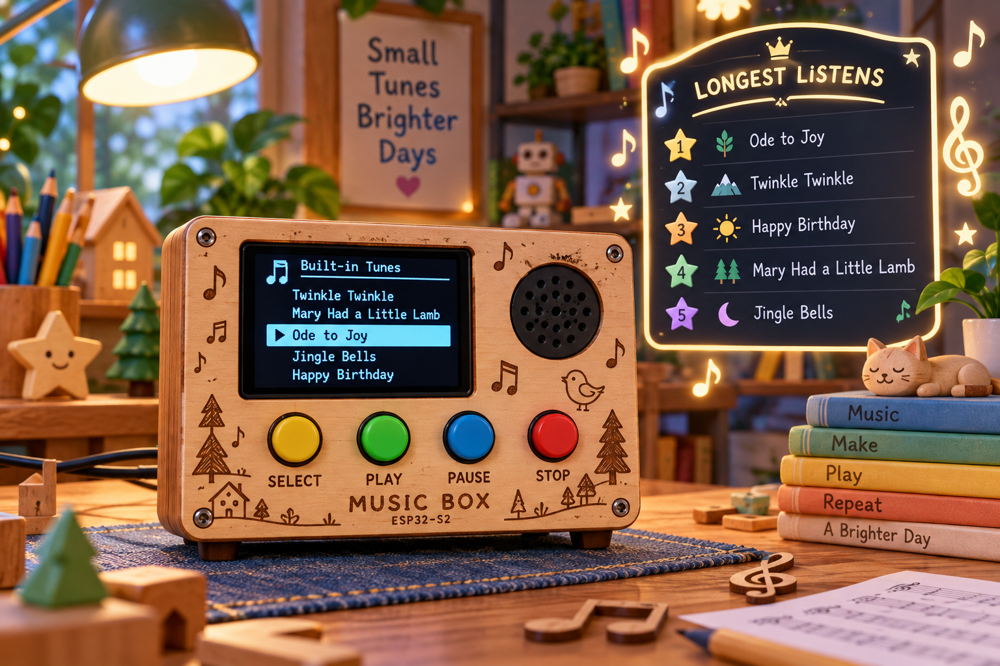
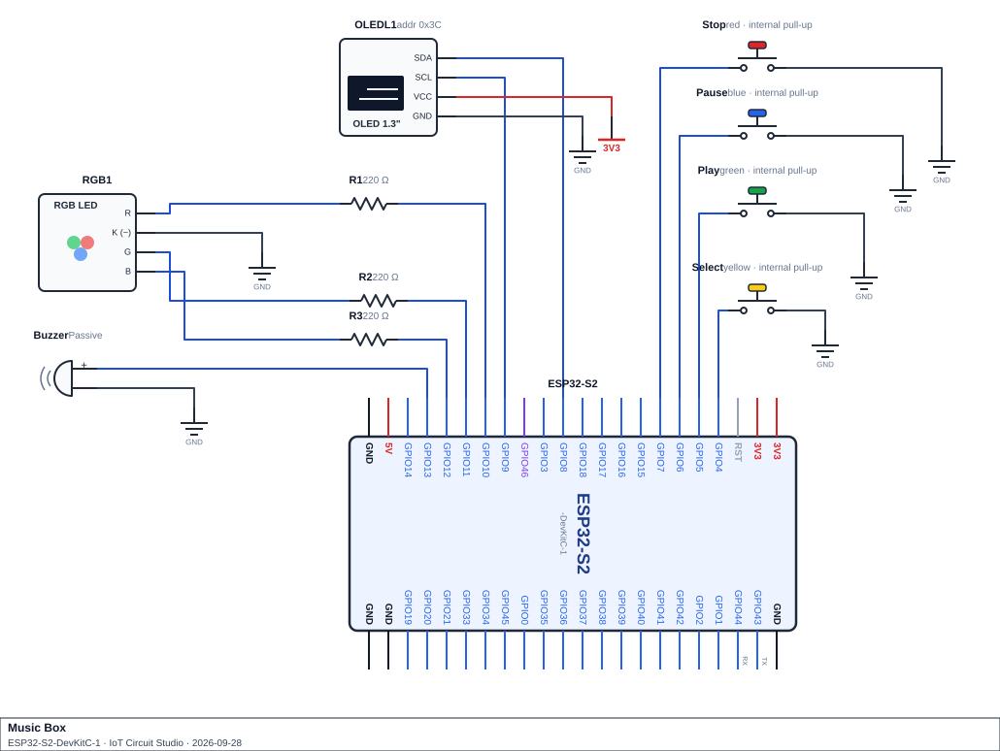

<h1 align="center">Music Box</h1>

<p align="center">
  
</p>

## Scenario
A toy maker wants a small electronic music box with a built-in library of five tunes. A visitor browses the tunes on an OLED screen and uses four buttons - **Select**, **Play**, **Pause** and **Stop** - to pick a tune, start it, pause and resume it partway through, or stop it and go back to the menu. While a tune plays, an RGB LED lights up in time with it: its colour follows how high or low the note is, and it breathes rather than snapping on and off. A passive buzzer is the speaker.

Each tune is stored as two parallel lists: a frequency for every note (0 means a rest, a deliberate silence) and how long that note should sound. Playing a note is not a single blocking call: it is two timed phases, an ON phase (the note sounds) followed by a short silent gap (so two notes of the same pitch in a row are still heard as separate notes), both timed off `millis()`.

The one precise piece of engineering in this build is the pause. Pausing has to freeze the music exactly where it is - not skip ahead, not restart the note, not lose track of which note is next - and resuming has to continue from exactly that point, no matter how long the pause lasted. That means the time spent paused must never be allowed to count as if the note had kept playing.

Every button press is checked against what the music box is currently doing: starting a tune, pausing, resuming and stopping are only valid in the right state, and an attempt made at the wrong time (pressing Play again while a tune is already playing, for example) is refused, logged and given its own short error tone rather than silently ignored. When a tune finishes, or is stopped early, how long it actually sounded for is added to a leaderboard of the longest listens.

The whole program runs without a single `delay()` in `loop()`. The note sequencer, the LED's breathing brightness, every tone and the OLED all run on timers, so the buttons stay responsive at all times.

## Components Required
- ESP32-S2 development board
- 4× push button (`INPUT_PULLUP`): Select, Play, Pause and Stop buttons
- RGB LED (common cathode) and 3× 220 Ω resistor, one per colour channel
- Passive buzzer (the music box's speaker)
- SSD1306 OLED display (128×64, I²C, address `0x3C`)
- Jumper wires, breadboard

> **Schematic:**

<p align="center">
  
</p>

> **Check your RGB LED type before you code.** A common-cathode LED lights when a pin goes high and its shared leg goes to GND. A common-anode LED is the opposite, and a higher `analogWrite()` value makes it dimmer. Wokwi's RGB LED is common cathode by default.

## Functional Requirements

1. **Event log.** `MusicEvent` struct (`type`, `value`, `timestamp`) in `event_log[MAX_EVENTS]`. Log every select, start, pause, resume, stop-early, complete and invalid-action event. Drop the oldest record when full.

2. **Inputs.** `ButtonState buttons[4]` (Select, Play, Pause, Stop). One shared, 40 ms debounced `button_pressed(ButtonState &button)`. `read_buttons()` checks all four every pass.

3. **Song library.** 5 built-in songs. Parallel `melodies[][]` (Hz, 0 = rest) and `noteDurations[][]` tables, plus a `Song` struct table (title, note count, gap %). `get_song_title()` returns a checked sentinel.

4. **Lookup tables**, each with a checked sentinel:
   - `get_setting(String key)` — debounce, gap%, display/report intervals, envelope attack/decay %. Sentinel `-1.0`; a missing key keeps the previous value.
   - `get_pitch_band(int frequency)` — 6 bands, checked lowest to highest with `<=`, 0 Hz its own band. Sentinel `-1`.
   - `get_band_name()` and `get_event_name()` — sentinel `"Unknown Band"` / `"Unknown Event"`.

5. **Playback engine.** Three states: MENU, PLAYING, PAUSED.
   - **MENU:** Select cycles the highlight (wraps). Play starts the highlighted song and logs it. Pause/Stop are invalid here.
   - **PLAYING:** non-blocking two-phase sequencer (ON then gap, timed off `millis()`, no `delay()`). On completion: stop tone, log, record the listen, return to MENU. Play again is invalid (doesn't restart). Pause stops the tone and records `pausedAt`.
   - **PAUSED:** Resume must shift the note's start time forward by the paused duration (`noteStartTime += millis() - pausedAt`) so playback picks up exactly where it left off. Stop works as below. Play/Select are invalid here.
   - **Stop** (PLAYING or PAUSED): stop tone, log "stopped early" with note reached, record the partial listen, return to MENU.
   - Any invalid button press for the current state: refused, logged, error tone.

6. **Outputs.**
   - RGB LED colour comes from indexing `bandColours[6][3]` by pitch band (no `if`/`else` chain). Off during a rest, gap, PAUSED or MENU.
   - Brightness follows a non-blocking attack/hold/decay envelope across each note's ON phase only (breathing effect).
   - A 2-D `uiTones[][2]` table holds 7 feedback tones (select, play, pause, resume, stop, complete, error), indexed directly, no `if`/`else` chain.
   - One shared non-blocking start/stop helper drives every tone. No `delay()`.

7. **Sorted structure — Longest Listens.** `ListenRecord` struct. Keep the 5 longest listens in `bestListens[]`, longest first, by insertion (not a full re-sort). Ties: earlier listen keeps the higher place (strict `>`). Insert exactly once per finished song, using listening time that excludes any paused time.

8. **Statistics.** `compute_stats()`: play counts per song, most-played song, completed vs. stopped-early counts, average listening time (guarded against divide-by-zero). Recompute after every logged event.

9. **Serial report**, non-blocking on a `report_interval_ms` heartbeat: state, current/highlighted song, note progress, play counts, most-played song, completed/stopped-early counts, average listening time, leaderboard, newest 5 events.

10. **OLED**, non-blocking on `display_interval_ms`, always ends with `display.display()`, fails gracefully if `display.begin()` fails.
    - **MENU:** song list, highlighted song in inverse video, instructions line.
    - **PLAYING/PAUSED:** title, `Note X/N`, progress bar, state (PAUSED in inverse video), current pitch band.

11. **No `delay()` anywhere in `loop()` or any function it calls.**

## Submission Requirements
- A working Wokwi link with your circuit built and your code loaded and running.
- Once it works in Wokwi, build the same circuit on real hardware and test it there too: a short video or photos of your physical circuit running your code.
- Your main source file (`.ino` if using the Arduino IDE, or `src/main.cpp` + `platformio.ini` if using PlatformIO).
- Brief written answers to the Reflection Questions below (a few sentences each is enough).

>[!NOTE]
> Wokwi link: https://wokwi.com/projects/476390477952834561

## Reflection Questions
Answer these in your own words. They're the kind of question the real Assessment 1 may ask you to justify verbally or in writing:

1. Walk through what would happen to a currently-playing timed action if a pause/resume feature simply resumed without adjusting its stored start time at all. Would the action end early, end late, or something else? What would a user notice?
   ```


   ```

2. A lookup table of ranges is checked from lowest to highest using `<=` on the edges. What would go wrong if the ranges were checked from highest to lowest instead? What would go wrong if `<` were used instead of `<=` on the edges?
   ```


   ```

3. An event is played in two separate timed phases (an active phase, then a gap) rather than one call left to finish on its own. What would a `delay()`-based gap between events break, even though the active phase itself was handled correctly? Why does the gap matter when two identical events happen back to back?
   ```


   ```

4. Walk through inserting a new value into a full sorted list that keeps the highest values first, when the new value ties with an entry already in the list. Where does the new value end up, and why doesn't it outrank the tied entry?
   ```


   ```

5. Why would a value like colour or behaviour come from indexing straight into a lookup table rather than a chain of `if (x == 0) ... else if (x == 1) ...`? What would have to change in the code (not just the data) to add one more category under each approach?
   ```


   ```

6. An invalid input - one that isn't valid in the device's current state - is refused, logged and given distinct feedback rather than being silently ignored. Why does that matter for a device that keeps an event log and a status report? Separately, why is one shared, reusable input-handling function better here than several near-identical functions, one per input?
   ```


   ```

7. Describe what an LED or other output would look like if its intensity were simply full-on for the whole active phase and then snapped off, with no fade at all. Why would fade-in and fade-out percentages apply only to the active phase, and not to the gap after it?
   ```


   ```

8. If you were given extra time to extend this project, what would you add, and which earlier topic would it draw on?
   ```


   ```
